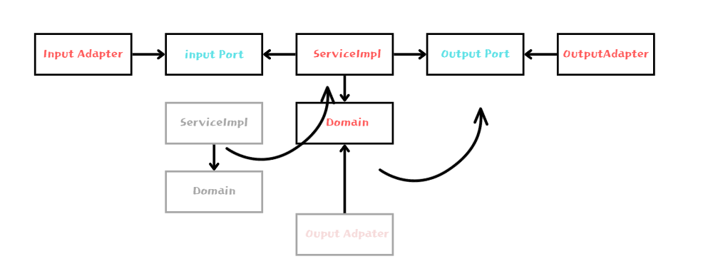

## 🧪 단위 테스트

### **1. 단위 테스트란?**
- 작은 코드 단위를 **독립적으로 검증**하는 테스트
- 주로 **클래스 & 메서드** 단위로 진행
- 외부 네트워크 등 **외부 환경에 의존하지 않는** 것이 중요
- 빠르고 안정적이라는 장점이 있음

### **2. 테스트 방식**
✅ **수동 테스트**: 사람이 직접 확인하는 테스트  
✅ **자동 테스트**: 기계가 최종적으로 검증하는 테스트

### **[3. JUnit 5](https://junit.org/junit5/docs/current/user-guide/)**
- Java 기반 **단위 테스트 프레임워크**
- XUnit 계열 (Kent Beck)
    - SUnit(Smalltalk), JUnit(Java), NUnit(.NET)

### **[4. AssertJ](https://assertj.github.io/doc/)**
- 테스트 코드 작성을 돕는 **테스트 라이브러리**
- 풍부한 API 제공 & **메서드 체이닝 지원** (가독성 향상)

### 📌 **테스트 케이스 세분화**

테스트를 더욱 철저하게 진행하려면, 다양한 **케이스를 분류하고 경계값을 고려**해야 합니다.  
아래와 같이 **해피 케이스**, **예외 케이스**, **경계값 테스트**를 체계적으로 정리할 수 있습니다.

---

### ✅ **1. 해피 케이스 (Happy Case)**
> **요구 사항을 정상적으로 만족하는 경우**  
> 일반적인 흐름에서 기대한 대로 동작하는지 확인

#### 📍 예시: `add(Beverage beverage, int quantity)`
- **1잔 추가했을 때** 정상적으로 리스트에 들어가는가?
- **여러 잔(2잔 이상) 추가했을 때** 정상적으로 추가되는가?
- **음료 삭제(remove)했을 때** 리스트에서 제거되는가?
- **전체 삭제(clear)했을 때** 리스트가 비어 있는가?

---

### ❌ **2. 예외 케이스 (Error Case)**
> **비정상적인 입력이 주어졌을 때** 적절한 예외가 발생하는지 확인  
> 암묵적(일반적으로 예상되는) 예외와 명시적 예외 모두 고려

### 📍 예시: `add(Beverage beverage, int quantity)`
- **0잔 추가 요청 (`quantity = 0`)** → `IllegalArgumentException` 발생해야 함
- **음수 개수 (`quantity = -1`)** → `IllegalArgumentException` 발생해야 함
- **매우 큰 개수 (`Integer.MAX_VALUE`)** → 성능에 문제가 없는가?
- **NULL 음료 추가** → `NullPointerException` 또는 적절한 예외 발생해야 함
- **존재하지 않는 음료 삭제 (`remove` 호출 시)** → 예외 발생 여부 확인

---

### 🔥 **3. 경계값 테스트 (Boundary Test)**
> **경계에서 동작이 올바르게 수행되는지 확인**  
> 값의 **이상(≥), 이하(≤), 초과(>), 미만(<)** 등의 조건을 테스트

#### 📍 예시: `add(Beverage beverage, int quantity)`
- **최소 주문 가능 개수 (`quantity = 1`)** → 정상 동작해야 함
- **최소보다 1개 적은 경우 (`quantity = 0`)** → 예외 발생해야 함
- **최대 주문 가능 개수 (`quantity = MAX_LIMIT`)** → 정상 동작해야 함
- **최대보다 1개 초과한 경우 (`quantity = MAX_LIMIT + 1`)** → 예외 발생해야 함

---

### 📆 **4. 날짜 및 시간 관련 테스트**
> **시간이 중요한 경우, 특정 시점 및 범위를 테스트**

#### 📍 예시: `order()` 메서드 (영업시간 내 주문 가능 여부)
- **영업 시작 직전 (`오전 9:59`)** → 주문 실패해야 함
- **영업 시작 시간 (`오전 10:00`)** → 주문 성공해야 함
- **영업 종료 직전 (`오후 9:59`)** → 주문 성공해야 함
- **영업 종료 시간 (`오후 10:00`)** → 주문 실패해야 함

---

### 🛠 **5. 범위 테스트 (Range Test)**
> 특정 값이 **범위 내**에 존재하는지 확인  
> 범위(최소 ~ 최대), 특정 구간, 값 포함 여부 등을 테스트

#### 📍 예시: 할인율 검증 (`getDiscountRate()`)
- **할인율이 0% 이상 50% 이하일 때** 정상 동작하는가?
- **할인율이 50%를 초과하면 예외가 발생하는가?**
- **할인율이 음수일 때 예외가 발생하는가?**

---

### 🎯 **6. 테스트 케이스 설계 시 고려할 점**
- **요구사항을 만족하는 정상 동작을 테스트했는가? (해피 케이스)**
- **입력값이 잘못된 경우를 모두 고려했는가? (예외 케이스)**
- **최소, 최대값 등 경계에서의 동작을 확인했는가? (경계값 테스트)**
- **범위, 구간, 날짜와 관련된 조건을 체크했는가? (범위 테스트)**

---
## **🧪 테스트하기 어려운 영역과 분리하는 방법**

소프트웨어 테스트를 수행할 때, 코드 내 특정 요소들이 테스트를 어렵게 만드는 경우가 많습니다. 이러한 요소를 식별하고 분리하면, 테스트의 신뢰성을 높이고 유지보수를 용이하게 할 수 있습니다.

---
### 🚧 1. 테스트하기 어려운 영역
테스트가 어려운 코드는 실행할 때마다 다른 결과를 반환하거나 외부 환경과의 상호작용에 의존하는 코드입니다.

#### 🔍 1) 관측할 때마다 다른 값에 의존하는 코드
- ⏳ 현재 날짜 및 시간 (`LocalDateTime.now()`, `System.currentTimeMillis()` 등)
- 🎲 랜덤 값 (`Math.random()`, `UUID.randomUUID()` 등)
- 🌍 전역 변수 (상태가 변경될 수 있는 변수)
- 🎤 사용자 입력 (`Scanner`, 웹 요청 등)

#### 🌐 2) 외부 세계에 영향을 주는 코드
- 🖨️ 표준 출력 (`System.out.println()`)
- 📩 메시지 발송 (이메일, SMS 등)
- 🗄️ 데이터베이스 기록 (INSERT, UPDATE, DELETE 등)
- 📡 네트워크 요청 (HTTP API 호출 등)

---

### ✅ 2. 테스트하기 쉬운 코드
테스트하기 쉬운 코드는 같은 입력값에 대해 항상 같은 결과를 반환하며, 외부 환경과 단절된 순수한 형태를 가집니다.

#### 🎯 1) 순수 함수
- 같은 입력값에 대해 항상 같은 출력값을 반환
- 외부 상태에 영향을 주지 않음
- 예제:
  ```java
  public int add(int a, int b) {
      return a + b;
  }
  ```

#### 🔄 2) 외부 의존성을 분리
- 현재 시간을 직접 호출하는 것이 아니라, 외부에서 주입받도록 설계
- 랜덤 값 대신 의존성을 주입받아 결정론적 테스트 가능하도록 구현
- 예제:
  ```java
  public class OrderService {
      private final Clock clock;
      
      public OrderService(Clock clock) {
          this.clock = clock;
      }
      
      public LocalDateTime getCurrentTime() {
          return LocalDateTime.now(clock);
      }
  }
  ```
  ```java
  Clock fixedClock = Clock.fixed(Instant.parse("2023-01-01T00:00:00Z"), ZoneId.of("UTC"));
  OrderService orderService = new OrderService(fixedClock);
  LocalDateTime time = orderService.getCurrentTime(); // 항상 동일한 시간 반환
  ```

#### 🏗️ 3) 인터페이스 및 의존성 주입(DI)
- 의존성을 인터페이스로 추상화하여 테스트 시 Mock 객체 사용 가능
- 예제:
  ```java
  public interface TimeProvider {
      LocalDateTime now();
  }

  public class RealTimeProvider implements TimeProvider {
      public LocalDateTime now() {
          return LocalDateTime.now();
      }
  }

  public class OrderService {
      private final TimeProvider timeProvider;
      
      public OrderService(TimeProvider timeProvider) {
          this.timeProvider = timeProvider;
      }
      
      public LocalDateTime getCurrentTime() {
          return timeProvider.now();
      }
  }
  ```
  ```java
  TimeProvider mockTimeProvider = () -> LocalDateTime.of(2023, 1, 1, 0, 0);
  OrderService orderService = new OrderService(mockTimeProvider);
  LocalDateTime time = orderService.getCurrentTime(); // 항상 2023-01-01 00:00 반환
  ```

---

### 🎯 3. 결론
테스트하기 어려운 요소를 분리하여, 예측 가능한 환경에서 테스트를 수행할 수 있도록 설계하는 것이 중요합니다. 이를 위해 다음과 같은 원칙을 적용할 수 있습니다.
1. **🔹 순수 함수 작성** – 같은 입력값에 대해 같은 결과 반환.
2. **🛠️ 의존성 주입(DI) 활용** – 외부 환경과의 직접적인 의존성을 제거.
3. **🎭 Mock 객체 활용** – 외부 시스템과의 상호작용을 테스트 시 시뮬레이션.
4. **⏰ 시간, 랜덤 값 등의 요소를 외부에서 주입** – 결정론적 테스트 가능하도록 설계.

---

## 🧪 단위 테스트 및 TDD
### 1. TDD (Test-Driven Development)란?
TDD(Test-Driven Development, 테스트 주도 개발)는 테스트를 먼저 작성한 후 기능을 구현하는 개발 방식입니다. 즉, 기능을 만들기 전에 먼저 해당 기능을 검증할 테스트 케이스를 정의하는 것이 핵심입니다.

#### TDD 사이클 (Red-Green-Refactor)
1. RED: 실패하는 테스트를 작성한다. (기능이 아직 구현되지 않았기 때문)
2. GREEN: 기능을 최소한으로 구현하여 테스트를 통과시킨다.
3. BLUE(REFACTOR): 중복을 제거하고 코드를 개선(리팩토링)한다.

#### 핵심 가치: 빠른 피드백
- 구현 코드와 테스트 코드에 대해 자주, 빠르게 피드백 받을 수 있음
- 유지보수가 용이하고, 유연한 코드 작성 가능
- 엣지(Edge) 케이스를 놓치지 않도록 보완 가능
---
### 2. TDD의 장점과 문제점
#### ✅ TDD의 장점
- 코드 품질 향상: 테스트가 보장되므로 안정성이 높아짐
- 빠른 피드백: 기능 변경 시 바로 문제점을 파악 가능
- 리팩토링 용이: 기존 기능을 보호하면서 코드 개선 가능
- 유연하고 유지보수가 쉬운 코드: 복잡도가 낮고 명확한 구조 유지 가능
- 엣지 케이스(Edge Case) 검증 가능: 예상치 못한 예외 처리 강화

#### ❌ 선 기능 구현, 후 테스트 작성의 문제점
- 테스트 누락 가능성: 기능 구현 후 테스트를 작성하면 중요한 부분을 놓칠 수 있음
- 특정 케이스만 검증: 해피 케이스만 검증하고 예외 상황을 고려하지 않을 가능성이 있음
- 잘못된 구현을 늦게 발견: 기능이 정상적으로 동작하는지 뒤늦게 파악 가능
---
### 3. TDD (RED-GREEN-REFACTORING) 적용

#### 📌 RED 단계 (실패하는 테스트 작성)
```java

@Test
    void calculateTotalPrice() {
        CafeKiosk cafeKiosk = new CafeKiosk();
        Americano americano = new Americano();
        Latte latte = new Latte();

        cafeKiosk.add(americano);
        cafeKiosk.add(latte);

        int totalPrice = cafeKiosk.calculateTotalPrice();

        assertThat(totalPrice).isEqualTo(8500);
    }
```

- calculateTotalPrice() 메서드가 아직 구현되지 않았으므로 테스트가 실패함.

#### 📌 GREEN 단계 (최소한의 구현 코드 작성)
```java
 public int calculateTotalPrice() {
       
    return 8500;
}
```

- 테스트를 통과하도록 가장 간단한 코드로 기능을 구현함.
- 하지만 하드코딩된 값을 사용하여 확장성이 부족함.

#### 📌 REFACTORING 단계 (리팩토링 및 개선)
```java
public int calculateTotalPrice() {
    int totalPrice = 0;

    for (Beverage beverage : beverages) {
        totalPrice += beverage.getPrice();
    }

    return totalPrice;
}
```

- Beverage 객체의 getPrice() 메서드를 활용하여 동적으로 총 가격을 계산하도록 개선.
#### 📌 REFACTORING 단계 (최적화 - Stream API 활용)
```java
 public int calculateTotalPrice() {

       return beverages.stream()
               .mapToInt(Beverage::getPrice)
               .sum();
}
```
- Stream API를 활용하여 더 간결하고 가독성이 좋은 코드로 리팩토링함.

### 4. 효과적인 TDD 실천 방법

1) 작은 단위부터 테스트하라
- 처음부터 큰 기능을 테스트하지 말고 작은 단위부터 점진적으로 확장하라.
- 예: add() → remove() → calculateTotalPrice() 순으로 테스트 작성
2) 모든 주요 케이스를 고려하라
- 해피 케이스 (정상적인 입력)
- 예외 케이스 (비정상적인 입력)
- 경계값 테스트 (최소/최대값, 초과/미만 등)
3) 테스트 코드를 유지보수 가능한 구조로 작성하라
- 가독성이 높은 테스트 네이밍 (should_동작_설명)을 사용
- 중복을 줄이고 공통된 설정(setup)은 @BeforeEach 등을 활용하여 정리
4) 외부 의존성을 분리하라
- 테스트하기 어려운 요소(시간, 랜덤 값, DB, 네트워크 요청 등)는 Mocking을 사용하여 분리하라.

---

## 💻 DisplayName
### ✅ 테스트 케이스 작성 가이드

📌 **문장형 기술 원칙**
- 명사의 나열이 아닌 **완전한 문장**으로 표현  
  ❌ `음료 1개 추가 테스트` → ✅ `음료를 1개 추가할 수 있다.`

📌 **결과까지 기술**
- 테스트 **행위의 결과**까지 포함  
  ❌ `음료를 1개 추가할 수 있다.`  
  ✅ `음료를 1개 추가하면 주문 목록에 담긴다.`

📌 **논리적인 조건 표현**
- 단순한 조건이 아닌, **정확한 논리**를 반영  
  ❌ `A이면 B이다.`  
  ✅ `A이면 B가 아니고 C다.`

📌 **도메인 용어 활용**
- 메서드 중심이 아닌 **도메인 정책 관점**에서 서술  
  ❌ `특정 시간 이전에 주문을 생성하면 실패한다.`  
  ✅ `영업 시작 시간 이전에 주문을 생성할 수 없다.`

---
### 🌟 BDD (Behavior-Driven Development, 행위 주도 개발)

BDD는 🛠**TDD**(Test-Driven Development, 테스트 주도 개발)에서 파생된 개발 방법으로,  
단순히 함수 단위의 테스트를 작성하는 것이 아니라, **📖 시나리오 기반의 테스트 케이스** 자체에 집중하는 방식.

---

### 🏗 BDD의 테스트 구조: **GIVEN-WHEN-THEN**

✅ **GIVEN (준비 🏁)**
- 시나리오 진행을 위한 **모든 준비 과정**을 설정.
- 예) "👤 사용자가 로그인되어 있고, 🛒 장바구니에 상품이 담겨 있음."

✅ **WHEN (실행 🚀)**
- 특정 **행동**(**액션**)을 수행.
- 예) "🖱 사용자가 결제 버튼을 클릭."

✅ **THEN (검증 ✅)**
- 기대하는 결과를 명시하고 검증.
- 예) "💰 결제가 완료되었다는 메시지가 표시."

---

### 🎯 BDD의 장점

✔ **👥 비즈니스 및 비개발자와의 원활한 소통**  
✔ **👀 테스트의 명확성과 가독성 향상**  
✔ **📌 요구사항 기반의 개발 진행 가능**


---
## 📌 `@SpringBootTest` vs `@DataJpaTest`

### 1️⃣ `@SpringBootTest` 🏗️
`@SpringBootTest`는 **Spring Boot 애플리케이션 전체 컨텍스트를 로드**하여 테스트를 실행할 때 사용.  
즉, **모든 빈(bean)을 로드**하여 통합 테스트를 수행할 수 있음.

#### ✅ 특징
- 애플리케이션의 **전체 컨텍스트**를 로드
- **모든 빈**이 활성화되므로 무거운 테스트가 될 수 있음
- 데이터베이스, 서비스, 컨트롤러 등 **전체적인 동작 테스트** 가능
- `webEnvironment` 옵션을 사용해 웹 서버를 실행할 수도 있음

#### ✅ 사용 예제
```java
@SpringBootTest
class MyApplicationTests {

    @Test
    void contextLoads() {
        // 애플리케이션 컨텍스트가 정상적으로 로드되는지 확인
    }
}
```

#### ⚙️ `webEnvironment` 옵션
```java
@SpringBootTest(webEnvironment = SpringBootTest.WebEnvironment.RANDOM_PORT)
class WebTest {
    @Autowired
    private TestRestTemplate restTemplate;

    @Test
    void testHomePage() {
        String body = this.restTemplate.getForObject("/", String.class);
        assertThat(body).contains("Welcome");
    }
}
```
- `WebEnvironment.RANDOM_PORT` → 랜덤 포트로 서버 실행
- `WebEnvironment.MOCK` → 내장 톰캣 없이 Mock 환경에서 실행

---

### 2️⃣ `@DataJpaTest` 🗄️
`@DataJpaTest`는 **JPA 관련 컴포넌트만 로드하여 테스트**할 때 사용합니다.  
즉, **Repository 계층 테스트에 최적화**되어 있습니다.

#### ✅ 특징
- **Entity, Repository만 로드**
- **데이터베이스 관련 기능만 테스트**
- 기본적으로 **H2** 같은 **임베디드 데이터베이스를 사용**
- **트랜잭션을 자동 롤백**하여 테스트 후 데이터가 남지 않음

#### ✅ 사용 예제
```java
@DataJpaTest
class UserRepositoryTest {

    @Autowired
    private UserRepository userRepository;

    @Test
    void testSaveAndFind() {
        User user = new User("spring", "spring@example.com");
        userRepository.save(user);

        User foundUser = userRepository.findByEmail("spring@example.com");
        assertThat(foundUser).isNotNull();
    }
}
```

#### ⚙️ `@AutoConfigureTestDatabase` 옵션
기본적으로 **H2 데이터베이스를 사용**하지만, **실제 DB를 테스트하려면 설정 변경이 필요**합니다.
```java
@DataJpaTest
@AutoConfigureTestDatabase(replace = AutoConfigureTestDatabase.Replace.NONE) // 실제 DB 사용
class RealDatabaseTest {
    @Autowired
    private UserRepository userRepository;

    @Test
    void testWithRealDB() {
        // MySQL, PostgreSQL 등 실제 DB에서 테스트
    }
}
```

---

## 🎯 정리
| 어노테이션 | 테스트 대상 | 특징 |
|-----------|-----------|------|
| `@SpringBootTest` 🌍 | 전체 애플리케이션 | 모든 빈 로드, 무거운 테스트, 통합 테스트 |
| `@DataJpaTest` 🗄️ | JPA 관련 클래스 (Repository) | JPA만 로드, 빠른 테스트, 기본 H2 DB 사용 |

✅ **`@SpringBootTest`는 전체적인 통합 테스트에 사용**  
✅ **`@DataJpaTest`는 JPA 관련 테스트에 최적화**된 어노테이션

---

## CQRS와 JPA 최적화를 위한 @Transactional 활용법 🔥
### 📌 읽기 전용 설정 (readOnly = true)
  - ✅ CRUD에서 CUD 동작 X → 오직 읽기만 가능 (Create, Update, Delete 불가)
  - 🚀 JPA 성능 향상 → CUD 스냅샷 저장❌, 변경 감지❌ → 불필요한 연산 감소

### 📌 CQRS 패턴
  - Command 와 Query 분리 → 서로 책임을 분리하여 독립적으로 운영

### 📌 트랜잭션 관리 방법
  - @Transactional(readOnly = true) → 클래스 전체 적용
  - CUD 메서드에는 @Transactional을 개별 적용 → 명확한 트랜잭션 관리 가능

  이렇게 설정하면 성능 최적화 & 유지보수 용이! 🚀
  
---

## 유효성 검사 어노테이션 비교: @NotNull, @NotEmpty, @NotBlank 🚫🏷️📝

`@NotNull`, `@NotEmpty`, `@NotBlank`는 Java에서 객체의 필드 값에 대한 유효성 검사를 수행할 때 사용하는 어노테이션들입니다. 

### 1. `@NotNull` 🚫
- **목적**: 필드가 `null`이 아니어야 한다는 제약을 설정.
- **특징**: `null`인 값만 체크하며, 빈 문자열(`""`)은 유효하다고 판단.
- **사용 예**: 객체가 존재하는지 반드시 확인하고 싶을 때.

```java
@NotNull(message = "이름은 필수입니다.")
private String name;
```

### 2. `@NotEmpty` 🏷️
- **목적**: 필드가 `null`이거나 빈 값(`""`)일 수 없다는 제약을 설정.
- **특징**: `null` 및 빈 문자열(`""`)을 모두 거부. 컬렉션의 경우, 요소가 하나 이상.
- **사용 예**: 텍스트 필드에 최소한의 데이터가 필요할 때 사용.

```java
@NotEmpty(message = "이메일은 필수입니다.")
private String email;
```

### 3. `@NotBlank` 📝
- **목적**: 필드가 `null`이거나 공백만 있는 문자열이 아니어야 한다는 제약을 설정.
- **특징**: `null`, 빈 문자열(`""`), 공백만 있는 문자열(`" "`)을 모두 거부. 즉, "공백이 아닌 실제 텍스트"가 있어야 함.
- **사용 예**: 텍스트 필드에서 의미 있는 값이 필요할 때 사용.

```java
@NotBlank(message = "주소는 필수입니다.")
private String address;
```

---
## 🏗️ **레이어드 아키텍처 vs. 핵사고날 아키텍처**

### **1️⃣ 레이어드 아키텍처 (Layered Architecture)**
📌 **전통적인 아키텍처로, 계층별로 역할을 분리하여 구성**하는 방식  
📌 **대표적인 3계층 구조 (Controller - Service - Repository)**

💡 **구성 요소**
1. **프레젠테이션 계층 (Presentation Layer)** 🎨
  - 사용자의 요청을 처리하고, 응답을 반환 (예: `Controller`)
2. **비즈니스 계층 (Business Layer)** 💡
  - 핵심 비즈니스 로직을 담당 (예: `Service`)
3. **퍼시스턴스 계층 (Persistence Layer)** 📦
  - 데이터베이스와의 CRUD 작업을 담당 (예: `Repository`)
4. **도메인 계층 (Domain Layer, 선택적)** 📜
  - 도메인 모델과 비즈니스 규칙을 정의

✅ **장점**  
✔️ 구조가 단순하고 이해하기 쉬움  
✔️ 역할이 명확하게 분리됨

❌ **단점**  
⛔ 계층 간 강한 결합이 발생할 수 있음  
⛔ 변화에 대한 유연성이 부족

---
## "📌 레이어드 vs. 핵사고날 아키텍처, CQRS, 락 전략! 🚀"


### **2️⃣ 핵사고날 아키텍처 (Hexagonal Architecture, Ports & Adapters)**
📌 **애플리케이션 핵심 로직을 외부 시스템과 독립적으로 유지하려는 아키텍처**  
📌 **"핵사고날"이 아니라 "핵사고날 것처럼 생긴" 구조** 🤣

💡 **구성 요소**
1. **도메인 (Domain) 🎯**
  - 애플리케이션의 핵심 비즈니스 로직 (독립적, 변경이 적음)
2. **어댑터 (Adapters) 🔌**
  - 도메인을 외부 시스템과 연결하는 역할 (예: `Controller`, `Repository`, `API Client`)
3. **포트 (Ports) 🔄**
  - 도메인과 어댑터 간의 인터페이스 (예: `UseCase`, `Repository Interface`)

✅ **장점**  
✔️ 도메인 로직이 외부 시스템(DB, API 등)에 종속되지 않음  
✔️ 테스트가 용이하고 확장성이 뛰어남

❌ **단점**  
⛔ 초기 설계가 복잡할 수 있음  
⛔ 적절한 인터페이스 설계가 필요

---

### **🔄 레이어드 아키텍처 vs. 핵사고날 아키텍처 비교**

| 아키텍처 | 장점 | 단점 | 적용 예시 |
|----------|------------------|------------------|------------------|
| **레이어드 아키텍처** 🏛️ | 구조가 단순, 이해 쉬움 | 계층 간 결합도 높음 | 전통적인 웹 애플리케이션 |
| **핵사고날 아키텍처** 🛠️ | 도메인 독립성, 유연함 | 설계 복잡 | 마이크로서비스, DDD 기반 프로젝트 |

---

## ⚡ **CQRS (Command Query Responsibility Segregation)**
📌 **"명령(Command)과 조회(Query)을 분리하는 패턴"**

💡 **CQRS의 핵심 개념**
1. **Command (쓰기) ✍️**
  - 데이터 변경(생성, 수정, 삭제) 요청
  - 보통 Event Sourcing과 함께 사용됨
2. **Query (읽기) 👀**
  - 데이터를 조회하는 요청
  - 읽기 전용 모델로 최적화 가능

✅ **장점**  
✔️ 읽기와 쓰기의 확장성을 개별적으로 조정 가능  
✔️ 성능 최적화가 용이

❌ **단점**  
⛔ 설계가 복잡하며, 유지보수 부담 증가  
⛔ 데이터 동기화 문제 발생 가능

📌 **사용 사례:**
- **이벤트 기반 시스템** (ex: Kafka)
- **고성능 읽기 최적화가 필요한 서비스** (ex: SNS 타임라인)

---

## 🔐 **낙관적 락 (Optimistic Lock) vs. 비관적 락 (Pessimistic Lock)**

### **1️⃣ 낙관적 락 (Optimistic Lock) 😊**
📌 **경쟁이 많지 않을 것으로 예상하고, 트랜잭션이 끝날 때 충돌을 검사하는 방식**

💡 **작동 방식**
- 데이터 조회 시 버전(`version`)을 함께 가져옴
- 업데이트 시 현재 버전과 DB의 버전이 같은지 확인
- 다르면 충돌 발생 → 갱신 실패

✅ **장점**  
✔️ 락을 사용하지 않아 성능이 뛰어남  
✔️ 읽기 작업이 많은 환경에서 유리

❌ **단점**  
⛔ 충돌이 발생하면 재시도가 필요함  
⛔ 동시 수정이 많을 경우 실패 가능성 증가

📌 **사용 사례:**
- **읽기 비중이 높은 서비스** (ex: 쇼핑몰, 게시판)
- JPA에서 `@Version`을 사용하여 구현

```java
@Version
private Long version;
```

---

### **2️⃣ 비관적 락 (Pessimistic Lock) 😡**
📌 **경쟁이 많을 것으로 예상하고, 트랜잭션 시작 시점에 락을 걸어버리는 방식**

💡 **작동 방식**
- 데이터를 수정할 때 **즉시 다른 트랜잭션의 접근을 차단**
- `SELECT ... FOR UPDATE` 같은 쿼리를 사용하여 락을 설정

✅ **장점**  
✔️ 충돌이 발생하지 않음 (다른 트랜잭션이 접근 불가)  
✔️ 동시 수정이 많은 경우 안전함

❌ **단점**  
⛔ 락이 걸려 있는 동안 다른 트랜잭션이 대기해야 함 → 성능 저하  
⛔ 데드락(교착 상태) 발생 가능성 있음

📌 **사용 사례:**
- **동시에 같은 데이터를 수정할 가능성이 높은 경우** (ex: 은행 계좌, 좌석 예약)
- JPA에서는 `@Lock(LockModeType.PESSIMISTIC_WRITE)`으로 사용 가능

```java
@Lock(LockModeType.PESSIMISTIC_WRITE)
@Query("SELECT p FROM Product p WHERE p.id = :id")
Product findByIdForUpdate(@Param("id") Long id);
```

---

## **🎯 낙관적 락 vs. 비관적 락 비교**

| 락 방식 | 장점 | 단점 | 사용 예시 |
|----------|------------------|------------------|------------------|
| **낙관적 락** 😊 | 성능 좋음, 락 없음 | 충돌 발생 시 재시도 필요 | 쇼핑몰, 게시판 |
| **비관적 락** 😡 | 충돌 방지, 데이터 안정성 | 성능 저하, 데드락 가능 | 은행 계좌, 좌석 예약 |

---

## 🎯 **정리**
✅ **레이어드 아키텍처**: 단순하고 이해하기 쉬운 구조지만, 계층 간 결합이 높음  
✅ **핵사고날 아키텍처**: 도메인 독립성을 강조하여 확장성과 테스트 용이성이 뛰어남  
✅ **CQRS**: 읽기/쓰기 분리로 성능 최적화 가능하지만, 복잡도가 증가함  
✅ **낙관적 락**: 충돌 감지 방식으로 성능이 좋지만, 충돌 시 재시도 필요  
✅ **비관적 락**: 락을 걸어 데이터 일관성을 보장하지만, 성능 저하 우려


## 🧪 Test Double
🪣 **Dummy** : 아무것도 하지 않는 깡통 객체

🏗 **Fake** : 단순한 형태로 동일한 기능 수행하지만, 프로덕션 사용에는 부족한 객체 (예: FakeRepository)

📌 **Stub** : 요청된 것에 대해 미리 준비한 결과를 제공하는 객체, 그 외에는 응답하지 않음

  - ✅ 상태 검증 중심

🔍 **Spy** : Stub이면서 호출된 내용을 기록하여 보여줄 수 있는 객체

  - 일부는 실제 객체처럼 동작하고, 일부만 Stubbing 가능

🎭 **Mock** : 행위에 대한 기대를 명세하고, 그에 따라 동작하도록 만들어진 객체

  - 🎯 행위 검증 중심

---
## 🔍 BDDMockito란? 🛠️
**BDDMockito**는 Behavior-Driven Development(행위 주도 개발) 스타일의 테스트를 지원하는 Mockito API.  
기존 `Mockito.when()` 대신 `BDDMockito.given()`을 사용하여 **가독성이 좋은 테스트 코드**를 작성 가능 📖✨
---
### 📌 주요 특징

1. **BDD 스타일 지원 🏗️**
  - 기존의 `when`보다 `given`을 사용하여 **테스트의 의도를 더 명확하게 표현**할 수 있음!
  - 예:
    ```java
    BDDMockito.given(service.callMethod()).willReturn("result");
    ```

2. **Mockito와 동일한 기능 제공 ⚡**
  - `when().thenReturn()` → `given().willReturn()`
  - `when().thenThrow()` → `given().willThrow()`
  - 기능적으로는 같지만 **BDD 방식에 맞는 표현**을 사용!

3. **가독성 향상 👀**
  - BDD는 **Given-When-Then 패턴**을 따르므로, `given()`을 사용하여 테스트 코드가 더 **읽기 쉬워지고 논리적인 흐름을 유지**할 수 있음
  - ex:
    ```java
    // Given
    given(userService.getUser("123")).willReturn(new User("Joo"));

    // When
    User result = userService.getUser("123");

    // Then
    assertEquals("Joo", result.getName());
    ```  

4. **테스트의 목적을 더 명확하게 🎯**
  - `when()`은 일반적인 모킹 표현이라 테스트의 목적이 모호할 수 있음
  - `given()`을 사용하면 **사전 조건(Given)이 강조**되어 **테스트의 의도 파악이 쉬움**

---

### 🏷️ `@ParameterizedTest`란?
JUnit 5에서 **여러 개의 다른 입력값**을 사용해 **같은 테스트 메서드를 반복 실행**할 수 있도록 도와주는 어노테이션. 📌

---

### 🎯 왜 사용할까?
✅ **반복되는 테스트 코드 줄이기** 📝  
✅ **다양한 입력값을 하나의 테스트에서 확인 가능** 🎲  
✅ **테스트 유지보수 용이** 🛠️

---

### 🎬 사용 예제
```java
@ParameterizedTest  // ✅ 여러 개의 입력값을 테스트할 수 있음
@ValueSource(ints = {1, 2, 3, 4, 5})  // 🎲 입력값을 배열로 전달
void testIsEven(int number) {  
    assertTrue(number % 2 == 0, "짝수인지 확인 ❌");
}
```
🔍 위 코드는 `1, 2, 3, 4, 5`를 각각 `number`로 받아 `짝수인지 확인`하는 테스트

---

### 🎭 다양한 데이터 제공 방식
1️⃣ **배열 값 전달** → `@ValueSource` 🎲  
2️⃣ **CSV 값 전달** → `@CsvSource` 📑  
3️⃣ **CSV 파일에서 읽기** → `@CsvFileSource` 📂  
4️⃣ **메서드에서 값 제공** → `@MethodSource` 🛠️  
5️⃣ **객체 변환 가능** → `@ArgumentsSource` 🎭

---

### ✅ 결론
💡 **`@ParameterizedTest`를 사용하면 반복적인 테스트 코드를 줄이고, 다양한 데이터로 쉽게 검증 가능!** 🚀

---
📌 **@DynamicTest** (JUnit 5)  
JUnit 5에서 **동적 테스트(Dynamic Test)**를 생성할 때 사용하는 애너테이션   
일반적인 `@Test`는 정적으로 정의되지만, `@DynamicTest`는 실행 시점에 동적으로 테스트를 생성 가능 🚀

---

## 🛠 **특징**
✅ **동적으로 테스트를 생성 가능**  
✅ **@Test 대신 사용** (일반적으로 `@TestFactory`와 함께 사용됨)  
✅ **테스트 케이스를 런타임에 동적으로 만들 수 있음**  
✅ **Stream, Collection 등을 활용 가능**

---

## 📝 **사용 예시**
```java
import org.junit.jupiter.api.DynamicTest;
import org.junit.jupiter.api.TestFactory;

import java.util.List;
import java.util.stream.Stream;

import static org.junit.jupiter.api.Assertions.assertTrue;

class DynamicTestExample {

    @TestFactory
    Stream<DynamicTest> dynamicTests() {
        List<Integer> numbers = List.of(1, 2, 3, 4, 5);

        return numbers.stream()
                .map(n -> DynamicTest.dynamicTest(
                        "Checking if " + n + " is positive",
                        () -> assertTrue(n > 0)
                ));
    }
}
```
---

## 🔥 **설명**
1️⃣ `@TestFactory`를 사용하여 테스트를 동적으로 생성 ✨  
2️⃣ `List.of(1, 2, 3, 4, 5)` 데이터를 기반으로 `DynamicTest`를 생성 🔄  
3️⃣ `DynamicTest.dynamicTest("테스트 이름", 실행할 테스트 코드)` 사용 🛠  
4️⃣ `assertTrue(n > 0)`로 각 숫자가 양수인지 검사 ✅

---

## 🎯 **언제 사용하면 좋은가?**
📍 **여러 입력 값에 대해 반복 테스트할 때**  
📍 **테스트 케이스를 런타임에 동적으로 생성해야 할 때**  
📍 **입력 데이터가 리스트, 컬렉션, 스트림 형태로 존재할 때**

---
## 📝 테스트 원칙 & 개념 정리

 - **테스트 하나 당 목적은 하나!**  
&nbsp;&nbsp;&nbsp;&nbsp;✅ 단일 책임 원칙 (SRP) 적용  
&nbsp;&nbsp;&nbsp;&nbsp;✅ 하나의 테스트는 하나의 기능만 검증

- **완벽 제어 🕹️**  
&nbsp;&nbsp;&nbsp;&nbsp;✅ 테스트 실행 흐름과 데이터 상태를 예측 가능하게 관리

- **테스트 환경의 독립성 🌍**  
&nbsp;&nbsp;&nbsp;&nbsp;✅ 테스트 실행 전후 상태 초기화  
&nbsp;&nbsp;&nbsp;&nbsp;✅ 다른 테스트에 영향을 주지 않도록 구성

- **Test Fixture 🏗️**  
&nbsp;&nbsp;&nbsp;&nbsp;✅ 테스트 실행을 위한 고정된 초기 상태 설정

- **🗑️ deleteAll() vs. deleteAllInBatch()**  
&nbsp;&nbsp;&nbsp;&nbsp;✅ `deleteAll()` → 엔티티 개별 삭제 (성능↓)  
&nbsp;&nbsp;&nbsp;&nbsp;✅ `deleteAllInBatch()` → 한 번에 삭제 (성능↑)

- **📌 @ParameterizedTest & @DynamicTest**  
&nbsp;&nbsp;&nbsp;&nbsp;✅ `@ParameterizedTest` → 다양한 입력값으로 반복 테스트  
&nbsp;&nbsp;&nbsp;&nbsp;✅ `@DynamicTest` → 런타임에 동적으로 테스트 생성

- **⚙️ 수행 환경 통합**  
&nbsp;&nbsp;&nbsp;&nbsp;✅ 테스트 환경과 실제 환경을 최대한 유사하게 구성

- **🔒 Private Method Test**  
&nbsp;&nbsp;&nbsp;&nbsp;✅ 간접적으로 공개 메서드를 통해 테스트  
&nbsp;&nbsp;&nbsp;&nbsp;✅ Reflection 활용 가능 (하지만 신중하게!)


---
## 📜 RestDoc vs Swagger

### 📝 RestDoc
✅ **장점**
- ✅ 테스트를 통과해야 문서 생성 🏆
- ✅ 프로덕션 코드에 비침투적 🚀

❌ **단점**
- ❌ 코드량 많음 📄📄
- ❌ 설정 어려움 🔧😵

---  

### 📖 Swagger
✅ **장점**
- ✅ 적용 쉬움 🎯
- ✅ 문서에서 바로 API 호출 가능 ⚡🔗

❌ **단점**
- ❌ 프로덕션 코드에 침투적 🏗️
- ❌ 테스트와 무관하여 신뢰도 낮을 수 있음 🤔  

---
### 🏗️ 아키텍트 목표

* **💡 인적 자원 절감**
* **📑 정책을 만들고 세부사항을 미루는 시스템 개발**

**개발 초기 단계에서 선택을 미루기:**

* 초기에는 **Oracle**인지 **MySQL**인지 선택할 필요 없음 🛑
* 초기에는 **Nginx**인지 **Apache**인지 선택할 필요 없음 🛑
* 초기에는 **REST**인지 **GraphQL**인지 선택할 필요 없음 🛑
* 초기에는 **Spring**을 적용할 필요 없음 🛑

**📍 도메인 우선 개발:**

* **💡 도메인**이 먼저 개발되어야 함

---

###  🔄헥사고날 아키텍처 [Spring Hexagonal Architecture](https://reflectoring.io/spring-hexagonal/)

* **🔄 의존성 역전 (Port-Adapter Pattern)**

  * **⚙️ 관심사의 분리**: 시스템의 각 부분을 독립적으로 관리할 수 있도록 분리
  * **🔒 고립화**: 서로의 영향을 받지 않도록 각 모듈을 독립적으로 만듦
  * **🔄 의존성 역전**: 외부 시스템의 변화가 내부 시스템에 미치는 영향을 최소화

* **🌱 진화하는 아키텍처**
  * 더 이상 필요하지 않은 **⛔ 계층**은 제거하고, 시스템의 구조를 유연하게 유지
---

### 📊 변화 예시

<p align="center">
  
  
  
  
</p>


